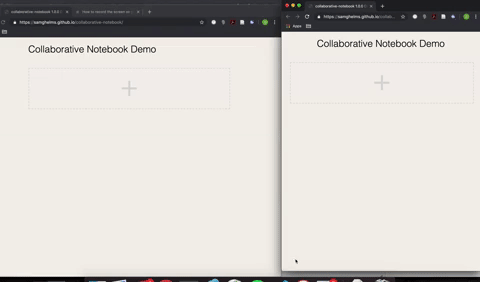

# Collaborative notebook

This is a demo that shows how conflict-free replicated data types (CRDT's) could allow collaborative editing on a notebook application like Jupyter via peer-to-peer communication.

I used the [`automerge`](https://github.com/automerge/automerge) library for its CRDT and the [breadloaf](https://github.com/antimatter15/breadloaf) for the notebook editor.

Try the demo out by opening up multiple tabs and chatting with yourself or some friends--your will automatically be connected to each other for peer-to-peer communication via a relay server.

https://samghelms.github.io/collaborative-notebook/

# Example

# Running locally

`cd` into the repo and run `nwb serve-react-demo`